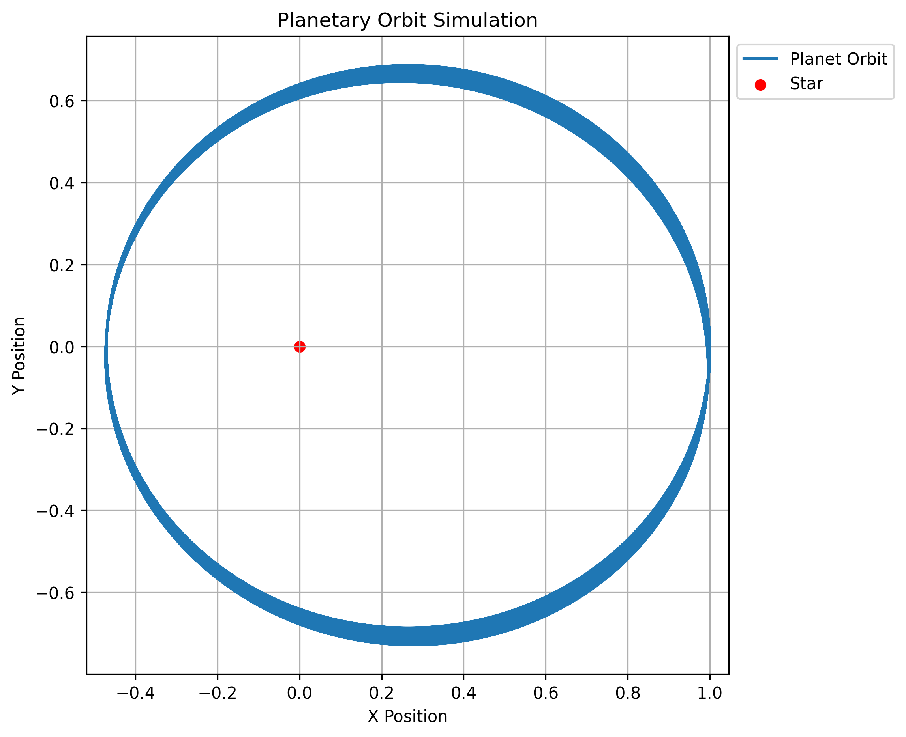

# Computational Methods in Astrophysics: A Beginner’s Introduction
This repository contains a beginner-friendly mini project on computational astrophysics. It introduces how numerical methods can be used to simulate planetary motion under gravity.

## Project Contents
Article: A short research-style write-up explaining the role of computational methods in astrophysics

Jupyter Notebook: Python simulation of a planet orbiting a star

Orbit Plot: Visualization generated from the simulation

## Tools Used
Python

NumPy

Matplotlib

Jupyter Notebook

## Project Overview
This project demonstrates a simple two-body gravitational simulation in which a planet orbits a central star. The motion is calculated numerically using the Velocity Verlet integration method. 

The simulation uses:

Gravitational constant: G = 1

Star mass: M = 100

Initial position: (1, 0)

Initial velocity: (0, 10)

Time step: 0.001

## Simulation Output 
### Two Object Simulation

## Files
Planetary_orbit_simulation.ipynb — simulation notebook

Planetary_orbit_simulation.png — orbit plot

Computational_methods_in_astrophysics_article.pdf — article document

## Key Learning Outcome
This project helped me explore how physics, mathematics, and programming can be combined to model astrophysical systems computationally.
